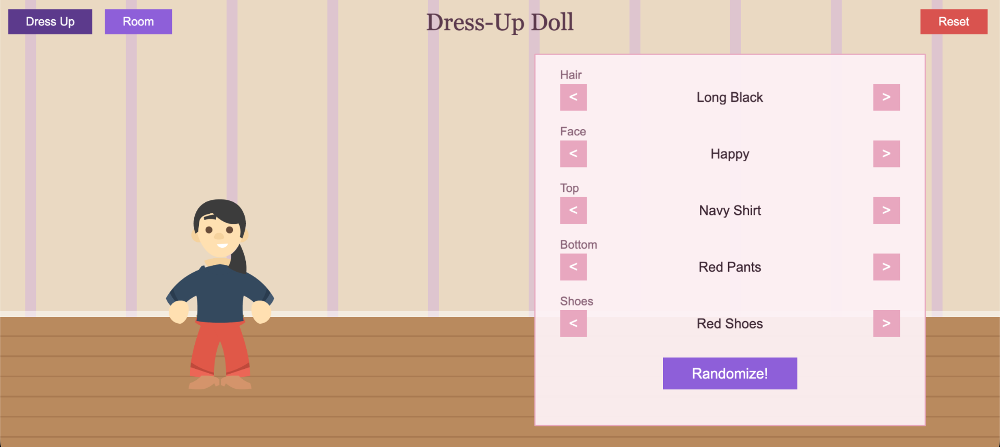

# Dress-Up Doll (Phaser 4 MVP)

A dress-up doll and room decoration game built with [Phaser 4](https://phaser.io/) and Vite.

**Play it live: https://dressup-doll.vercel.app**



## Features

- Doll with 5 customisable categories: hair, face, top, bottom, shoes
- Cycle variants per category with `<` / `>` buttons, or hit **Randomize!**
- Room decoration mode: place furniture from the inventory, drag it anywhere,
  drag back onto the bar to remove
- The doll stands in the room and can be dragged around too
- Everything (outfit, furniture, doll position, active mode) persists to
  `localStorage` — refresh and it's all still there; **Reset** clears it
- Full-screen responsive canvas (16:9 Full HD base, EXPAND scale mode)

## Art

All art comes from [Kenney](https://kenney.nl/) asset packs (CC0):
[Modular Characters](https://kenney.nl/assets/modular-characters) for the doll
and [Furniture Kit](https://kenney.nl/assets/furniture-kit) for the room.

## Run

```bash
npm install
npm run dev      # dev server at http://localhost:5173
```

## Build

```bash
npm run build    # production build to dist/
npm run preview  # serve the production build
```

## Quality

```bash
npm run lint     # ESLint
npm run format   # Prettier (write)
```
